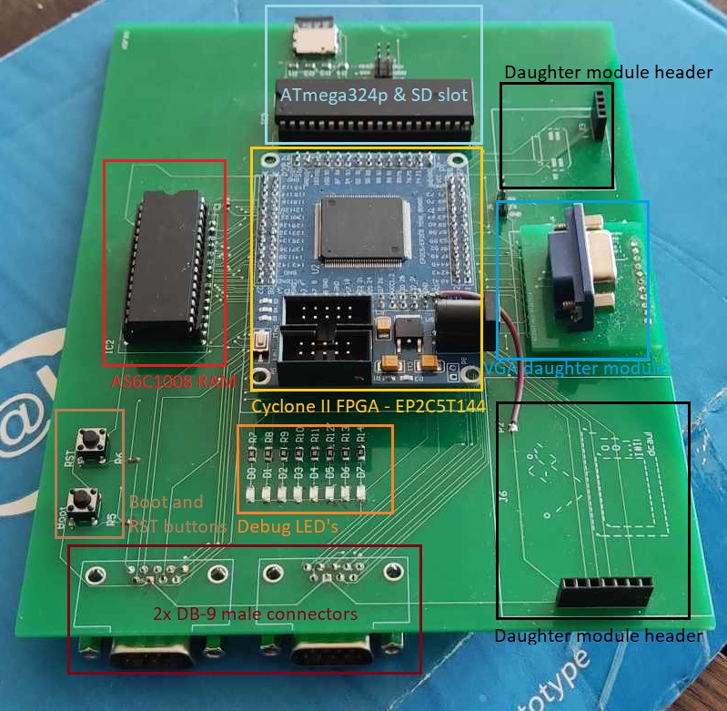
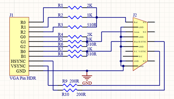

# Ages


## Ages introduction
In today's world, as gaming technology advances, there's a growing trend among gamers from the older generation to revisit the nostalgia of vintage game consoles and computers. This project introduces a modular retro computer system, driven by a Z80 softcore, which powered iconic consoles like the Game Boy and Amstrad GX4000. Implemented on a Cyclone II FPGA, this system offers flexibility for various modules and can emulate classic games on a 16x16 LED matrix. Vintage Sega Megadrive joysticks provide the control. Welcome to "Ages" — your gateway to retro gaming experiences.

This README.md covers the technical details of this project.

### Table of contents
 * [High level overview](#high-level-overview)
   * [Block diagram](#block-diagram)
   * [Ages physical components](physical-components)
   * [Ages HDL based components](hdl-components)
 * [Daughter modules and applications](#daughter-modules)
   * [Audio module](#audio-module)
   * [CRT module](#crt-module)
   * [VGA module](#vga-module)
 * [LED matrix](#led-matrix)
   * [Games](#games)
   * [LED matrix implementation](#led-matrix-implementation)
     * [Build process](#build-process)
     * [Integration with Z80 softcore and external hardware](#memory-map)
     * [Joystick implementation](#joystick)
     * [Power up process](#powerup-process)
       * [SD Card data pre-fetch](#sd-prefetch)
       * [UART based bootloader](#uart-bootloader)
     * [Framebuffer](#framebuffer)
     * [Nokia 5110 LCD screen](#lcd)
  * [qWsImageEditor](#qwsimageeditor)

* [Acknowledgement](#acknowledgement)
* [References](#references)

<a name='high-level-overview'></a>
## High level overview

<a name='block-diagram'></a>
### Block Diagram
Before delving into the explanation of the Ages system, this section provides a high-level overview of the structure of the Ages project. This will aid in understanding its operation in subsequent chapters.


The above block diagram illustrates the main components used in Ages, encompassing both digital components housed within the FPGA logic (beige color) and physical components connected to the system via the motherboard (orange color). It also shows how the components are interconnected with the logic.

<a name='physical-components'></a>
### Ages physical components
This section shows the (main) physical components used in the Ages system together with a brief description:
- Cyclone II FPGA <br> Cyclone II is at the heart of Ages, housing the Z80 softcore along with all the digital logic required to control the physical components (or any daughter modules) from a Hardware Description Language (HDL). Cyclone II utilizes the Altera EP2C5T144 FPGA IC.
- AS6C1008 <br> 128KB static RAM
- ATmega 324p & SD card slot <br>To provide flexibility to the Ages user, an ATmega 324p microcontroller is included on the motherboard. Its purpose is to read data from an SD card (via SPI) and then send it to the AS6C1008 RAM IC through the Cyclone II FPGA. This allows the possibility of "preloading" data from an SD card and placing it at a specific location in RAM. This can be useful in cases where visual data needs to be stored in RAM.<br>A SPI header is provided on the motherboard to facilitate programming of the ATmega 324p.
- 2x DB-9 connectors <br> Since many retro joysticks use a female DB-9 connector, the motherboard is equipped with 2 male DB-9 connectors. In this implementation, Sega Mega Drive joysticks are connected to these connectors.
- UART pin header <br>To facilitate the easy uploading of program code for the Z80 softcore into the RAM memory, a UART header is provided on the motherboard. This header includes a transmit pin that can be used for debugging purposes. Additionally, the header features a receive pin. In the current Ages setup, the receive pin is utilized to place program data for the Z80 into the RAM memory at address 0 via an FTDI module.
- 2 push buttons <br> Boot & Reset
- 8 debug LEDs


The above picture illustrates the main physical components on the Ages motherboard.

<a name='hdl-components'></a>
### Ages HDL based components
As previously explained, Ages consists of physical main components that are connected to the FPGA via the motherboard and are controlled by HDL-defined (digital) logic components. These logic components can vary depending on the system's needs or the use of daughter modules. In this exposition, the HDL components used in the context of the 16x16 LED matrix are described. In this project, only the VHDL language was used as the HDL.
- Z80 softcore (Not self made!) <br> Ages utilizes a Z80 softcore, which acts as the microcontroller in the system. It is clocked at 12.5MHz, like every HDL-based component in this system. This component is responsible for processing the game system's program code, primarily programmed in the C language. <br> Source: https://opencores.org/projects/t80
- SRAM controller <br> When the Z80 softcore boots, one of the requirements is that it is connected to RAM memory, from which executable program code can be fetched. To enable communication between the FPGA and the physical AS6C1008 IC, a RAM controller is present in the design. This controller allows, for example, the Z80 to write data to and read data from the RAM via a 16-bit wide address bus. Additionally, the RAM controller facilitates receiving a program via a VHDL UART component and writing this program to address 0x00 in the RAM memory, allowing the Z80 softcore to execute the program.
- UART RX (not self made!) <br> In the current implementation of Ages, this component is used twice: <br> To receive data from an SD card via an ATmega 324p through UART and then write it to memory. <br> To place the serial data sent by an FTDI through the UART header into memory address 0x00, allowing the Z80 softcore to execute it. See "Power-up Process" for more details.<br>Source: https://nandland.com/uart-serial-port-module/
- Joystick logic <br> Used to read input from Sega Mega Drive joysticks through the DB-9 connectors and pass it to the Z80 softcore using an interrupt-based architecture. See chapter [Joystick](#joystick).
-	WS2812b LED controller <br> This VHDL-based component receives a framebuffer of 6144 bits in this setup. Each WS2812 LED expects 24 bits: 8 bits for the red channel, 8 bits for the green channel, and 8 bits for the blue channel. Since the 16x16 LED matrix has 256 LEDs, the total data to drive them is 256 * 24 = 6144 bits. These incoming bits are then sent to the LED matrix using the serial WS2812b protocol. See [framebuffer](#framebuffer).

<a name='daughter-modules'></a>
## Daughter modules and applications
The previous chapter provided an introduction to the components and their purposes in the system. This chapter will delve into external daughter modules designed for Ages, showcasing some of the many possibilities of the system.

<a name='audio-module'></a>
- Audio module <br>  <br>  <br> This module is designed for playing audio through a 2.5mm audio jack, where an external audio player can be connected. The module utilizes a low voltage audio op-amp (LM386), which receives an audio signal, amplifies it, and then sends it to the audio jack. <br> Please note that this module is not used in the context of the 16x16 LED matrix application. It has been tested by generating a square wave with a frequency of 18kHz in VHDL and connecting headphones to it. This allows for playing mono audio through Ages.
<a name='crt-module'></a>
- CRT module <br>  <br>  <br> In the world of retro computing, iconic cathode ray tubes (CRTs) are an integral part. That's why this module is designed to easily send images to a CRT screen via a composite cable using the Ages FPGA. This module utilizes an RGB to NTSC/PAL converter, with the responsible IC being the AD724. This IC takes an RGB signal along with HSync and VSync signals as input and converts these signals into the analog signals expected by the CRT. <br> Please note that the input signals received by this module are similar to those of a VGA interface (R, G, B, HSync, VSync). The AD724 IC is configured in this module to operate in PAL mode, as PAL is commonly used in Europe. <br> The AD724 module needs to be powered at 5 volts. The header to which this module is connected has a solder pad that can be bridged either to the 3.3-volt supply of the FPGA or the 5-volt supply of the FPGA. This design choice provides flexibility to the designer using Ages, allowing them to power a module either at 5 volts or 3.3 volts as needed. <br>  <br> In this case, the power supply for the module header is connected to 3.3 volts from the FPGA. Due to time constraints, it was not possible to test this module.
<a name='vga-module'></a>
- VGA module <br> <br> <br> Another well-known retro display technology is Visual Graphics Array (VGA), which is more commonly associated with home computers than game consoles. VGA is inherently an analog protocol, while FPGAs operate digitally. Therefore, this VGA module uses a resistor network that functions as a Digital to Analog Converter (DAC). The Cyclone II FPGA operates with 3.3-volt logic, so this resistor network is designed to work with 3.3-volt logic and is compatible exclusively with it. <br> Please note that in the figure above, the VGA port is on the top side of the PCB on the left and on the bottom side on the right. This is due to a design error in the PCB, which resulted in the signals being reversed on the VGA port. <br> As a Proof of Concept, a VGA component in VHDL was created for Ages. It retrieves an ASCII framebuffer of 80x60 bytes from the external RAM IC and translates it into the correct binary data using a font ROM, following the principle below: <br> 

<a name='led-matrix'></a>
## LED matrix
In the pursuit of creating a complete retro console utilizing all the main components from Ages (as described in the [previous chapter](#block-diagram)), the decision was made to control a 16x16 LED matrix. This matrix consists of a WS2812b LED strip arranged in a matrix configuration. In order to achieve a better pixelated effect, a matrix was printed using a 3D-printer. This to ensure that colors wouldn't flow over into each other. <br>  <br>
The game console currently features three simple games: Snake, Brick Breaker, and Pong. Among these three games, only Pong is multiplayer. Additionally, the project includes a Nokia 5110 LCD screen to display scores and text-based menus to the player. This is necessary because it's not possible to display text or scores on the 16x16 LED matrix during gameplay. <br>
 <br>
This chapter will provide an overview of the game console and delve into the implementation of both the hardware and software components.
<a name='games'></a>
### LED matrix games
When the Z80 softcore is booted, a menu will appear on the LED matrix, allowing the player to choose a game.<br>
 <br>
As previously mentioned, it's not possible to display game titles on the LED matrix, so these titles are shown as text on the Nokia 5110 LCD.
<br>  <br>
- Snake <br>  <br>  <br> The LCD shows the scores (which is the length of the snake). <br> Each time the snake's length increases, the movement speed increases as well. When the player's snake reaches a certain length, the level increases, and the snake slows down, gradually speeding up again. However, if the player's snake touches any of the four edges of the matrix or collides with its own body, the game is over.
- Brick breaker <br> <br> On the LCD screen the score is shown (amount of brics x 10)<br> <br> Once the player reaches a score of 80, the top bricks will start moving from left to right. When the player misses the ball with the paddle, the game is over.
- Pong <br><br> <br> Pong is the only multiplayer game. When one of the players reaches a score of 10, that player wins the game. The winning player's name is displayed on the LCD, as shown in the image above. <br> <br> When a player scores, they receive the ball on their paddle and can then launch the ball at the desired height toward the opponent. As a player reaches a score of 3, 6, or 8, the ball's speed increases to raise the game's difficulty level. <br>
- Game over state <br> As mentioned earlier, it's possible for a player to have a game over in Snake and in Brick Breaker. When a player experiences a game over, it will be displayed on both the LED matrix and the LCD screen. <br>  <br> The player can then press 'START' to return to the main game menu.
<a name='led-matrix-implementation'></a>
### LED matrix technical implementation
This chapter will delve deeper into some technical aspects of components that are essential to realize this project. This includes parts of the C code, the build process, integration of the softcore with external hardware via a memory-mapped architecture, how the framebuffer works, prefetching data from the SD card to RAM, the UART-based bootloader, and the operation of the joysticks via interrupts.
<a name='build-process'></a>
#### Build process
The code executed on the Z80 softcore is primarily written in C. Only a few parts are written in inline assembly, which includes delays and functions that need to execute Z80 instructions not accessible via the C language.<br><br>
Since the target architecture is Z80, and the development process took place on a computer, the Small Device C Compiler (SDCC) was used. This compiler provides the capability to cross-compile for architectures like Z80 and 8051.
<br><br>The following bash script compiles all software components into a unified whole:
```
#!/bin/bash
sdasz80 -xlos -g crt0.s
sdcc -o main.rel -c --std-c11  --stack-probe -mz80 --debug --no-std-crt0 -Iinclude main.c
sdcc -o z80_lib.rel -c --std-c11 --stack-probe -mz80 --debug --no-std-crt0 -Iinclude lib/z80_lib.c
sdcc -o joystick.rel -c --std-c11 --stack-probe -mz80 --debug --no-std-crt0 -Iinclude lib/joystick.c
sdcc -o ws2812b-matrix.rel -c --std-c11 --stack-probe -mz80 --debug --no-std-crt0 -Iinclude lib/ws2812-matrix.c
sdcc -o position.rel -c --std-c11 --stack-probe -mz80 --debug --no-std-crt0 -Iinclude lib/position.c
sdcc -o snake.rel -c --std-c11 --stack-probe -mz80 --debug --no-std-crt0 -Iinclude lib/snake.c
sdcc -o brick_breaker.rel -c --std-c11 --stack-probe -mz80 --debug --no-std-crt0 -Iinclude lib/brick_breaker.c
sdcc -o menu.rel -c --std-c11 --stack-probe -mz80 --debug --no-std-crt0 -Iinclude lib/menu.c
sdcc -o lcd.rel -c --std-c11 --stack-probe -mz80 --debug --no-std-crt0 -Iinclude lib/lcd.c
sdcc -o pong.rel -c --std-c11 --stack-probe -mz80 --debug --no-std-crt0 -Iinclude lib/pong.c
sdasz80 -plosgffwy main.rel main.asm
sdasz80 -plosgffwy z80_lib.rel z80_lib.asm
sdasz80 -plosgffwy joystick.rel joystick.asm
sdasz80 -plosgffwy ws2812b-matrix.rel ws2812b-matrix.asm
sdasz80 -plosgffwy position.rel position.asm
sdasz80 -plosgffwy snake.rel snake.asm
sdasz80 -plosgffwy brick_breaker.rel brick_breaker.asm
sdasz80 -plosgffwy menu.rel menu.asm
sdasz80 -plosgffwy lcd.rel lcd.asm
sdasz80 -plosgffwy pong.rel pong.asm
sdcc -o main.ihx -mz80 -Wl -y --code-loc 0x0500 --data-loc 0x5000 --std-c11 --stack-probe -mz80 --debug --no-std-crt0 crt0.rel main.rel z80_lib.rel joystick.rel ws2812b-matrix.rel position.rel snake.rel brick_breaker.rel menu.rel lcd.rel pong.rel
sdobjcopy -I ihex -O binary main.ihx main.bin
cp main.bin ../../../../Downloads/main.bin
rm *.rel *.sym *.ihx *.noi *.adb *.lst *.asm *.lk *.cdb *.map
```
A [Makefile](Firmware/Z80-Firmware/Makefile) was also created which achieved the same goals as the bash script seen above. <br><br>
Please note that the first command compiles a [crt0.s](Firmware/Z80-Firmware/crt0.s) file. This is the startup code, which contains an interrupt vector and determines, for example, where the stack is placed in memory:
```
.module crt0
.globl	_main
.globl    l__INITIALIZER
  .globl    s__INITIALIZER
  .globl    s__INITIALIZED
.area	_HEADER (ABS)
;; Reset vector
.org 	0
jp	init
.org	0x08
reti
.org	0x10
reti
<snipped>
init:
; Small delay.  Not sure why, but helps boot work after
; FPGA direct programming
ld      B,#0x40
1$:
djnz	1$
;; Set stack pointer
;ld	sp,#0x8000
ld sp, #0xf7ff
;; Initialise global variables
call	gsinit
<snipped>
```
In the final linking command, it is also specified from which address the code will be placed in memory and from which address the data will be located:
```
sdcc -o main.ihx -mz80 -Wl -y --code-loc 0x0500 --data-loc 0x5000 --std-c11 --stack-probe -mz80 --debug --no-std-crt0 crt0.rel main.rel z80_lib.rel joystick.rel ws2812b-matrix.rel position.rel snake.rel brick_breaker.rel menu.rel lcd.rel pong.rel
```
For inline assembly, SDCC allows usage of the '__asm ... __endasm' directive:
```
void joystick_isr(void)__naked{
  __asm
  <snipped>
  __endasm;
}
```

<a name='memory-map'></a>
#### Integration with Z80 softcore and external Hardware
As previously mentioned, the microcontroller (softcore) in this system resides within an FPGA. This means there is no physical Z80 microcontroller on the motherboard; instead, it's replicated hardware within the FPGA, hence the name "softcore."

In the case of having a physical Z80 microcontroller on the motherboard, it would be possible to connect external hardware to the I/O ports of the Z80 microcontroller and control these I/O ports from software through a potential memory-mapped architecture.

Therefore, in this case, it was necessary to build a memory-mapped architecture within the FPGA logic (VHDL) to enable Z80 programmers to control I/O ports (which are mapped to an FPGA pin) through specific memory addresses. This allows for the connection of external peripherals to the Z80 softcore.

This was achieved in the following way:

As an example, let's consider the memory map for LED0 (line 404). The RAM write line, which is active low (active when '0' and inactive when '1'), will be set to '1' (indicating no write operation to RAM) when rst = '1' (the softcore has booted), and the softcore places "000001000010000" on the address bus, which in hexadecimal is 0x210. This prevents the value from the data bus from being written to the actual RAM memory.

Simultaneously with the explanation above, the following occurs:
<br>  <br>
When address "000001000010000" appears on the Z80 address bus and z80_wr is '0' (active low), it means that the data on the data bus is ready to be stored in the specified address. Then, the least significant bit on the data bus will be set on the LED(0) line.

LED(0) is mapped to the FPGA pin connected to the first LED of the external debug LEDs. This allows you to control the LED from software (C code) running on the Z80 softcore in the following way:
```
#include <stdio.h>
#include <stdint.h>
#include <stdlib.h>
#include <mem_map.h>
#include <z80_lib.h>

int main(){
  while(1){
    LED0 = 1;
    delay10us();
    delay10us();
    LED0 = 0;
    delay10us();
    delay10us();
  }
  return 0;
}
```

The `mem_map.h` contains SDCC directives for intrinsic named address spaces, which allows to allocate a name to a memory address:
```
__sfr  __banked __at (0xff)  joystick1;
__sfr  __banked __at (0xfe)  joystick2;
__sfr  __banked __at (0x210) LED0;
__sfr  __banked __at (0x211) LED1;
__sfr  __banked __at (0x212) LED2;
__sfr  __banked __at (0x213) LED3;
<snipped>
```

<a name='joystick'></a>
#### Joystick implementation
The joysticks used in this project are Sega Mega Drive joysticks. Many retro consoles prefer to work with 5-volt logic. Despite the Cyclone II using 3-volt logic, it is still possible for these two to communicate with each other. Additionally, these joysticks also use active-low logic, which means that when, for example, the 'UP' button is pressed, a logical '0' will appear on the pin responsible for the 'UP' button.

The pin layout of the joystick buttons on the DB-9 connector is as follows:
<br>  <br>
The UP, DOWN, LEFT, and RIGHT buttons each have their own pin on the DB-9 connector. Buttons A and B share one pin, and buttons START and C share one pin. Additionally, there are ground and power lines and a SELECT line.

The SELECT line is an input to the joystick and is toggled at a specific frequency. When the SELECT line is low (logical '0') and button A is pressed, a logical '0' will appear on pin '2_AB.' If the SELECT line is high (logical '1'), a logical '0' will appear on the '2_AB' line.

Through the combination of the '2_AB' (output) line and the 'SELECT' (input) line, the system to which the joystick is connected can determine when button 'A' or 'B' was pressed, even though they share a common pin on the DB-9 connector. This is reflected in the following VHDL code, where the 'tmp_toggle' signal represents the 'SELECT' line: <br>
 <br> <br>
<p></p>

The left figure, displays the (physical) input signals that come from the joystick to the FPGA, with all signals starting with 'in_.' As shown in lines 7 and 8, buttons 'A,' 'B,' and 'C,' as well as 'SEL,' are shared signals.

At the bottom of the left figure, you can see the output signals, starting with 'out_.' Please note that 'A,' 'B,' 'C,' and 'SEL' each have their own signal here and are no longer shared. This is a result of what happened in the previous figure.

The figure on the right illustrates how the (physical) signals coming from the joystick are mapped to a 'joystick1_reg.' This is an 8-bit register `std_logic_vector(7 downto 0)` located within the FPGA.

Joysticks operate from the perspective of Z80 software using interrupts. For this purpose, Interrupt Mode 2 provided by the Z80 architecture is utilized. <br>
 <br>
The above image shows how Interrupt Mode 2 is configured on the Z80. Here's how it works: a base address for the interrupt vector is chosen. In this case, the most significant byte of this address (0xf8) is placed in register i (lines 40 & 41). Every time an interrupt request occurs, the Z80 in interrupt mode 2 expects a byte to be placed on the data bus, and this byte will determine the index in the interrupt vector. For example, if register i contains 0xf8, and an interrupt request occurs with the data bus receiving 0x00, the Z80 will read the address stored at 0xf800. The code located at the address spread across locations 0xf800 and 0xf801 will then be executed as an interrupt.

The above code ensures that the address where the 'joystick_isr' function is located spans addresses 0xf800 and 0xf801.

In this setup, interrupt requests for the joystick are periodically generated from the FPGA logic (VHDL) as follows:


Every 5000 clock pulses, the 'joystick_int' signal goes to logic '0'. Given that the system is clocked at 12.5 MHz, this occurs every 400 microseconds.

The Z80 architecture has an active low interrupt signal. When a logic '0' is applied to this signal, the Z80 will assert a logic '0' on the (active low) IOREQ line.


The figure above shows that when 'rst' = '1' (Z80 softcore is booted) and the Z80 asserts a logic '0' on the IOREQ line, a 0x00 is placed on the Z80 data bus (line 437).

As mentioned earlier, this means that the Z80 software has received an interrupt request at this moment and a 0x00 on the data bus, which causes the code at the address specified at address 0xf800 - 0xf801 to be executed via interrupt mode 2. In this case, it's the actual interrupt routine for the joysticks.

This interrupt is defined as follows: <br>


On line 15, 'in a, (_joystick1)' is executed. This will have the effect of the Z80 softcore asserting a logic '0' on the (active low) IOREQ line and also placing the value 0xFF (joystick1) on the address bus.

Line 432 and 433 ensure that when the Z80 softcore makes IOREQ low and 0xFF ("000000011111111") appears on the Z80 address bus, the contents of joystick1_reg will be placed on the Z80 data bus.

In the previous picture, line 16, executes the following: 'ld 0x200, a', which ensures that the contents of the data bus (currently the contents of joystick1_reg) will be placed in location 0x200 in RAM memory.

TLDR ; An interrupt request is triggered every 400 microseconds, causing the contents of joystick1_reg (an 8-bit register containing the state of the joystick buttons) to be placed at RAM address 0x200.

Subsequently, each joystick button can have 4 states: the button is just pressed, the button is held down, the button is just released, or the button is not pressed. These states are defined in the following C enum: <br>

<br>
Next, in the joystick library, there is a function provided to read the current state for a specified button:

When the poll_button function is executed, it will examine the values of the buttons in joystick1_reg. This value is then compared to the stored value in *gamepad_state. Based on this comparison, the current state of a button can be queried. When this function is executed, the value in *gamepad_state is also updated according to the current state.

<a name='powerup-process'></a>
#### Power up process
So far, we've only discussed what happens when the Z80 softcore is booted, in other words, from the moment the 'BOOT' button on the motherboard is pressed. However, there are two important things that occur before the 'BOOT' button is pressed.

<a name='sd-prefetch'></a>
- Power up process – SD kaart pre-fetch <br> In Chapter 2.2, "Ages (Physical) Components on the Motherboard," it was mentioned that the motherboard includes an ATmega 324p connected to an SD card slot. The ATmega 324p is connected to the Cyclone II FPGA via UART, which is in turn connected to the RAM. This allows the Ages user/developer to, for example, load visual data from an SD card (such as sprites, tiles, etc.) into a specific location in RAM when the motherboard is powered on. The ATmega 324p can be programmed using an Atmel AVR ISP, using the provided SPI header on the motherboard.  <br>The connections from the ATmega 324p to the SPI header and the SD card are as follows: <br> Please note that both the SPI header and the SD card slot use the SPI pins of the ATmega, so it is recommended to remove the SD card before programming the ATmega 324p. <br>The ATRX0, ATTX0, ATRX1, and ATTX1 lines (bottom left) are the UART lines connected to physical pins on the FPGA. <br>The 'main' function programmed on the ATmega 324p in this setup is as follows: <br>When the Ages motherboard is powered, the ATmega 324p will also boot, and the above code will be executed. <br> Line 49 initializes the UART, which has a baud rate of 38400 in this case. Then, a FAT filesystem is mounted, and memory is allocated for it. <br> For this, the FATFS library was used (http://elm-chan.org/fsw/ff/00index_e.html). <br> Next, the file "game-over.bin" will be read from the SD card. <br> On line 58, a while loop starts, which ensures that 512 bytes are read from the file pointer into the buffer. The 512-byte buffer will then be sent byte by byte via the `USART_Transmit(...)` function to the FPGA. <br> <br> On the FPGA side, a VHDL-based UART Receive component is needed to receive this data at a baud rate of 38400. <br>  <br> Line 196 in the above figure defines the baud rate. The _z80_clk_ signal to which this UART RX component is clocked has a frequency of 12.5MHz. The calculation is as follows: <br> 12500000Hz / 38400 (baud rate) = 325. Hence, the generic on line 196 gets the value 325. <br> On line 200 `i_RX_Serial => sd_rx`, here 'sd_rx' is a signal mapped to the physical FPGA UART RX pin, which is also connected to the UART Transmit pin of the ATmega 324p. <br> This means that on this pin, the serial data from the ATmega UART comes into the FPGA. <br> On line 202 `o_RX_byte => sd_byte`, the received (serial) data from the _sd_rx_ line is reassembled into one byte. Therefore, _sd_byte_ is an 8-bit vector `std_logic_vector(7 downto 0)`. <br> Furthermore, the received data needs to be placed in the RAM memory at a specific location.  When on line 267 `sd_busy = '1'`, a byte is received on the SD UART), these received bytes will be placed in memory starting from RAM address 36864 ("01001000000000000", 0x9000). Every time a new byte is received, this memory address will be incremented by 1. The content of _sd_byte_ is placed on the 'bootl_datin' bus (data bus) of the bootloader (on line 273). The 'wr_boot' signal is set to logic '1' (line 274), causing a write operation to occur in RAM (between lines 278 and 282). <br> <br> TLDR ; In this setup, as soon as the motherboard is powered on, the ATmega 324p microcontroller will also boot, and it will read a file from the SD card ("game-over.bin") and send it to the FPGA via UART. The FPGA will place the data from "game-over.bin" in the RAM memory starting at address 36864 (0x9000). The data from the "game-over.bin" file is then available in the RAM memory. <br> <br> In this case, the application mentioned above was used to create the Game Over screen that is displayed on the LED matrix. As mentioned earlier, the data from the SD card is loaded into memory location 0x9000. <br>  <br>The image above shows a pointer to address 0x9000 on line 17. Using the `get_framebuffer()` function, 256 bytes are read from location 0x9000 into the framebuffer. <br> In the main function, the `get_framebuffer()` function is called, and then the contents of the framebuffer are read into the 'game_over_screen' buffer (lines 33 to 35): <br>  <br> <br> Conclusion: The Game Over screen for the LED matrix is read from the SD card via the ATmega 324p and then transmitted over UART to the FPGA, where it is placed in RAM at location 0x9000, making it available for the Z80 softcore.
<a name='uart-bootloader'></a>
- Power up process – UART based bootloader <br> An important requirement to boot the Z80 softcore is that it has access to its executable program code and program data. This must reside in the RAM memory before booting can occur. When the Z80 boots, it will start executing its program from RAM at address 0x00. Since Ages is a development platform, it's also essential that the program code for the Z80 can be easily uploaded to the memory. Therefore, a UART header is provided on the motherboard.  <br> Through a USB to Serial converter (FTDI), the programmer can easily upload the program code for the Z80 to the RAM memory. In VHDL, a UART Receive component is instantiated for this purpose: <br>  <br> The chosen baud rate for this UART is 115200: 12500000Hz/115200(baud) = 108. Line 189 takes the _uart_rx_ signal as an input signal, which is mapped to the physical FPGA pin connected to the UART header shown in figure 48. The serial UART data that comes in on this pin is combined into a single byte on line 191, and this byte is represented as the _rx_data_ 8-bit vector `std_logic_vector(7 downto 0)`. <br>  <br> As explained in the [previous section](#sd-prefetch), when `busy_rx = '1'` (line 266, a byte is received via UART), this byte is placed in RAM starting from address 0x00. Each time a new byte is received, it is placed at the next RAM address, and 'wr_boot' is set to logical '1', triggering a RAM write operation. When this process is completed, pressing the 'BOOT' button will cause the Z80 softcore to boot up and start executing its program from RAM address 0x00. <br> Please note that the implementation of the UART Receive VHDL component was not written by myself; it was sourced from: https://nandland.com/uart-serial-port-module/.

<a name='framebuffer'></a>
#### Framebuffer
At the end of the [SD card data prefetch chapter](#sd-prefetch), we first mentioned the framebuffer, which is loaded with data from the SD card at RAM address 0x9000. However, the operation of the framebuffer is more extensive than it might initially seem. How it works through 'double buffering' on the software side and in the FPGA logic is discussed below.

- Software side (Z80 C-code) <br> The framebuffer is used to control the 16x16 LED matrix. The LED matrix consists of 256 LEDs (16x16=256), and the software-side framebuffer also consists of 256 bytes. This means there is one byte per LED. Each byte in this framebuffer is responsible for one LED on the matrix and can take on the value of either 0x00 (binary: "00000000") or 0xFF (binary: "11111111"). In this context, 0xFF represents a lit LED, and 0x00 represents an unlit LED. <br> The Z80 software written in C-code includes the following functions to read and write to the framebuffer, using double buffering: <br>  <br> Line 3 contains a pointer to address 0x9000, which is where the framebuffer is located in memory and is read by the hardware (VHDL) to send data to the LED matrix. <br> <br> Line 4 contains an array called _framebuffer_ consisting of 256 bytes. This is the "double" buffer. <br> <br> Imagine that the programmer wants to make several modifications to a frame (software-wise), and the frame should only be displayed on the matrix after all these modifications are made (not after each small modification). Let's say the programmer wants to make 3 modifications to a frame, and this frame should only be displayed on the matrix after all 3 modifications have been made. In other words, the frame should not be visible on the matrix after modification 1 or modification 2 but only after all 3 modifications have taken place. To provide this capability, "double buffering" is used. <br><br>The _framebuffer_ array on line 4 is the "double" framebuffer. It contains the data that the programmer wants to display on the matrix. Once all the modifications are made to the framebuffer array, the programmer can send it to the matrix using the `update_framebuffer(uint8_t fb[])` function (lines 12 - 16). This function will copy the contents of the framebuffer array to the RAM starting at address 0x9000 (the memory read by the hardware to process it for the LED matrix).<br><br> Lines 6 – 10, the `clear_framebuffer()` function is used to clear the double buffer (_framebuffer_ array), with the goal of turning off all LEDs on the matrix. Note that this operation is performed on the (double) framebuffer array, and to apply this to the LED matrix, the `update_framebuffer(uint8_t fb[])` function still needs to be executed.<br><br>Lines 18 – 22, the `get_framebuffer()` function copies the data that is on the actual (hardware) framebuffer, starting from address 0x9000, to the framebuffer (double buffer) array. <br> <br> Furthermore, there are additional functions provided to manipulate individual LEDs in the framebuffer, using x and y coordinates and a mapping from 2D to a pixel (LED) index in the framebuffer. <br> 

- Hardware side (FPGA VHDL logic) <br> When the software places the desired framebuffer at address 0x9000, it becomes available for the hardware. The hardware can then process it into signals for the WS2812 LED matrix. <br> When the framebuffer is at address 0x9000, there is a 256-byte array here. <br> 0x9000 - 0x9100 is the address range for the framebuffer. <br> <br> The way WS2812 LEDs work is that each LED in the chain has an 8-bit Red (R) channel, an 8-bit Green (G) channel, and an 8-bit Blue (B) channel. These 8-bit values determine the intensity of the individual Red, Green, and Blue colors (RGB). This also means that each LED in the chain expects a 24-bit value. The LED matrix has 256 LEDs, which means 256x24 = 6144 bits, or 768 bytes, need to be sent each time to update the matrix. <br> <br> As mentioned earlier, there is a byte array of only 256 bytes (2048 bits) at address 0x9000. This is processed by the VHDL code as follows:  <br> When the LED matrix is ready to receive new data, indicated by line 268 (ws_ready = '1'), the RAM address (which at that moment is 0x9000, in binary: "01001000000000000", and in decimal: 36864) is placed on the RAM address bus. The data available on the data bus of the RAM at that moment is the data that the Z80 softcore has placed in the (hardware) framebuffer. It will then check whether this byte is 0xFF or 0x00. If it's 0xFF, it will set '1' in a std_logic_vector(255 downto 0) called buff; if it's 0x00, it will set '0' in buff (lines 275 to 279).<br>This process happens for all the bytes in the (hardware) framebuffer, from address 0x9000 (36864 decimal) to address 0x9100 (37120 decimal) between lines 269 and 282. The result of this process is that you have a vector, named buff, in VHDL consisting of 256 bits. These bits represent the bytes (0xFF or 0x00) from the framebuffer.<br><br>Now, this vector `buff` needs to be converted into a framebuffer that the WS2812 LED matrix can use. In other words, a 6144-bit vector where a '1' from the `buff` vector should be translated into 24 '1's in the 6144-wide vector. A '0' from `buff` should also be translated into 24 '0's in the 6144-wide vector. This 6144-bit vector is called _frame_buf_ in this case.<br><br>This is achieved from line 284 to 286.<br>For example, if `buff(0) = '1'`, meaning the first bit of `buff` is '1', then all bits in the range frame_buf(6143 downto 6120) must have the value '1'. <br>If `buff(7) = '0'`, meaning the 8th bit of buff is '0', then all bits in the range of frame_buf from 5975 to 5952 must be '0'.<br>This is done in the for loop in line 285:
```
frame_buf((6143-(k*24)) downto ((6143-(k*24))-23)) <= (others => buff(k));
```
Once the 6144-bit wide `frame_buf` is set up, ws_enable is set to '1' (provided that the Z80 softcore is not in an interrupt routine), as seen in lines 287 to 289. After this, tmp_addr_cnt is reset to 0x9000 (36864 decimal), so that the next framebuffer placed in memory by the Z80 softcore can be retrieved.

<a name='lcd'></a>
#### LCD screen
To display a more extensive menu and scores to the player, a Nokia 5110 LCD screen was used. These screens communicate via an SPI-like protocol. To interface this LCD screen with the Z80 softcore, there were two possible approaches: implementing the SPI interface in VHDL or directly memory mapping the LCD pins to the Z80 softcore, as described in section 4.3.2.

Generally, the first approach is the most efficient and performance-oriented option. However, due to time constraints and limitations in the available FPGA logic, the second approach was chosen. As seen in section 4.3.2, specific memory-mapped locations are reserved for SPI communication:

The SPI_CLK, SPI_DOUT, data_command, chip_enable, and SPI_RST signals are directly mapped to the pins of the Nokia 5110 LCD. The SPI protocol expected by the Nokia 5110 LCD was then bit-banged in the C code running on the Z80 softcore.


<a name='qwsimageeditor'></a>
#### qWSImageEditor
To easily create and display specific 16x16 LED matrix patterns/images, a program was written in Qt C++. This program is designed for drawing images and then saving them in the desired format.

Using this software, the user can easily create a drawing in a 16x16 pixel format and then save it as PNG, a C-array, binary text string, or in binary format. For the options of C-array, binary text string, and binary, it is also possible to choose to save it as monochrome (1 bit per pixel), in which case the image data will consist of 32 bytes. This software was used, for example, to draw the Game Over screen and create the pattern for the 'bricks' in Brick Breaker.

<a name='acknowledgement'></a>
### Acknowledgement
I wanted to thank my teacher Wim Dams and [mennovf](https://github.com/mennovf) for all the help and advice I got from them during the realization of this project.

<a name='references'></a>
### References
 - https://www.google.com/
 - https://www.pocketmagic.net/avr-sdcard-fat-support-with-fatfs/
 - https://nandland.com/uart-serial-port-module/
 - https://www.edaboard.com
 - https://opencores.org/projects/t80
 - https://chat.openai.com/
 - https://www.snapeda.com/
 - https://stackoverflow.com/
 - https://internalregister.github.io/2021/08/08/Another-Homebrew-Console.html
 - https://www.zilog.com/docs/z80/um0080.pdf
 - https://sdcc.sourceforge.net/doc/sdccman.pdf
 - https://www.asm80.com/
 - https://www.toptensoftware.com/fpgabee/
 - Internet
